# PokeDex
An interactive Pokedex for Mobile Devices using Xamarin Forms.

**Currently includes maximum nostalgia for Gen 1 including original Ken Sugimori artwork**

This pokedex is includes the regular stats for each Pokemon such as:

- Name
- Number
- Genera
- Footprint
- Description
- Egg Group
- Type(s)
- Abilities
- Stats
- Height
- Weight
- Shape
- Habitat
- Capture Rate
- Growth interactive

It also includes the Original Green and Blue artwork by Ken Sugimori.

Thank you to Red_O_Zone for recreating the original Red and Blue sprites pixel perfect.

Thank you to PokeAPI for providing the data used for this pokedex.

| 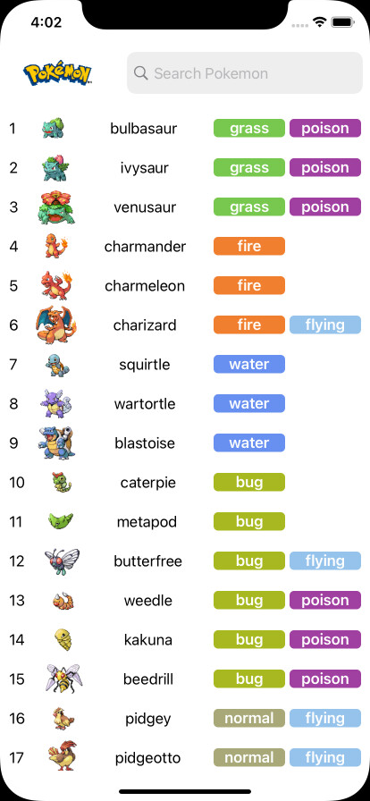 | 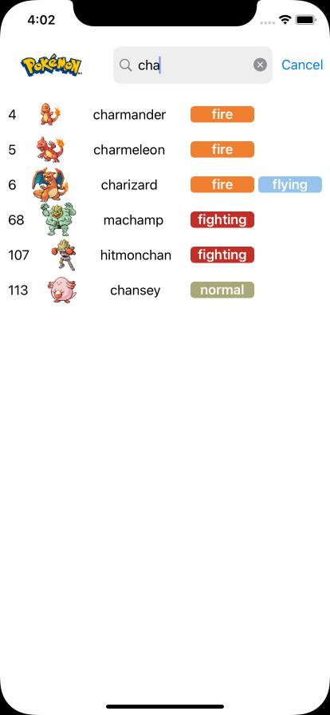 | 
|-------------------|-------------------|
| 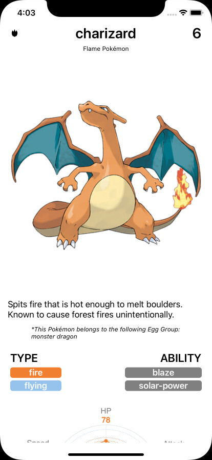 | 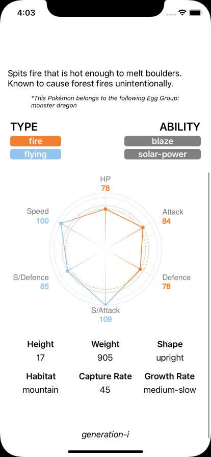 | 
| 
| 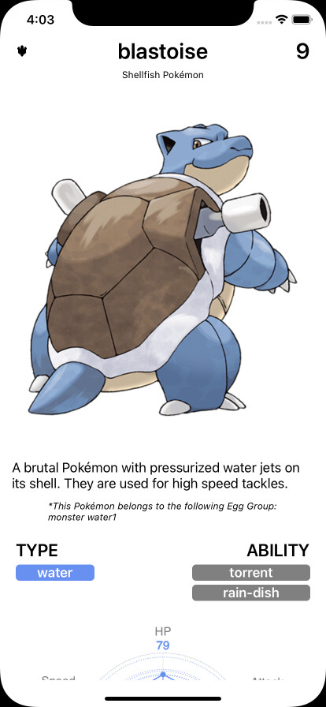 | 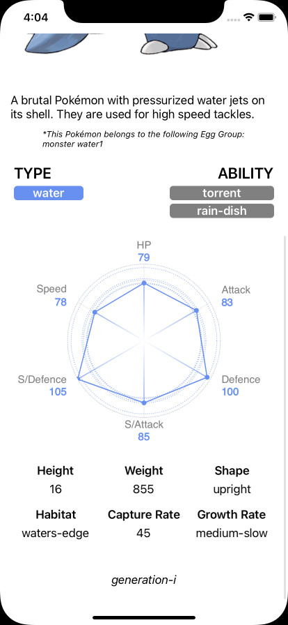 | 
| 
| 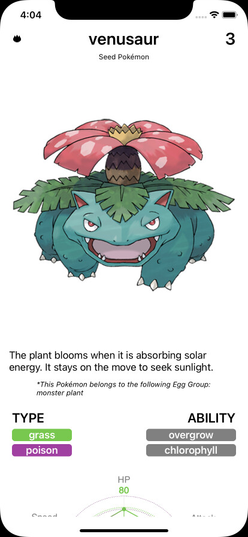 | 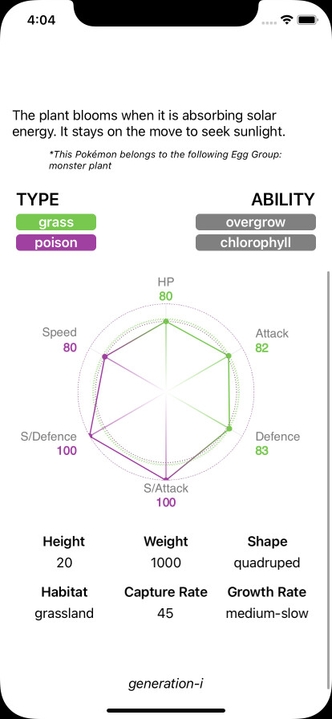 | 
|
| 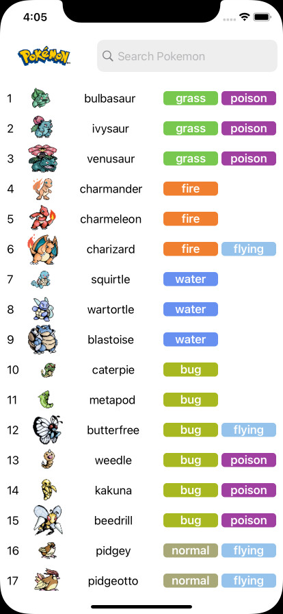| 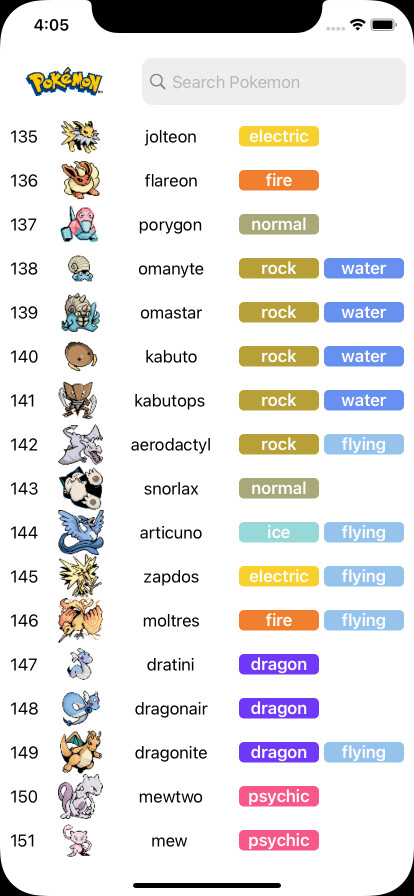| 
|
| 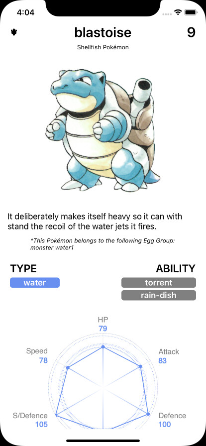| 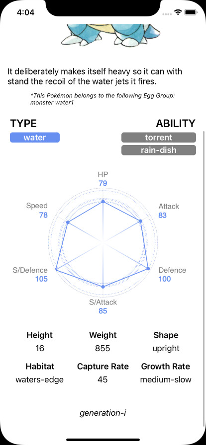| 
|
| 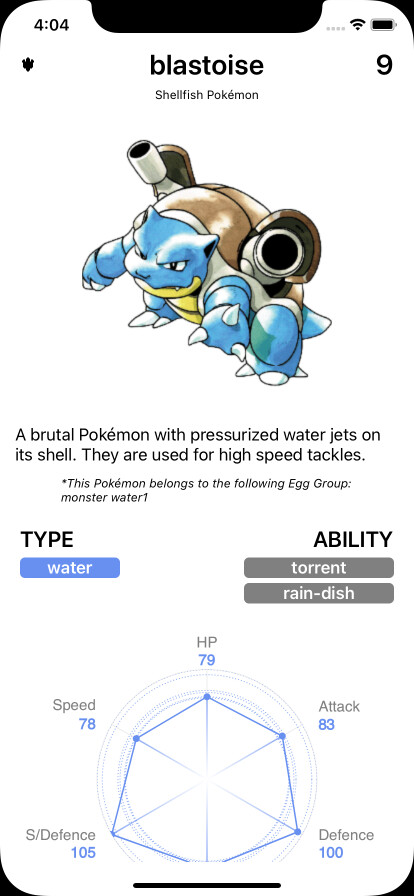| 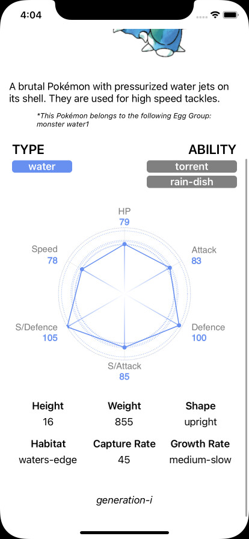| 
|
| 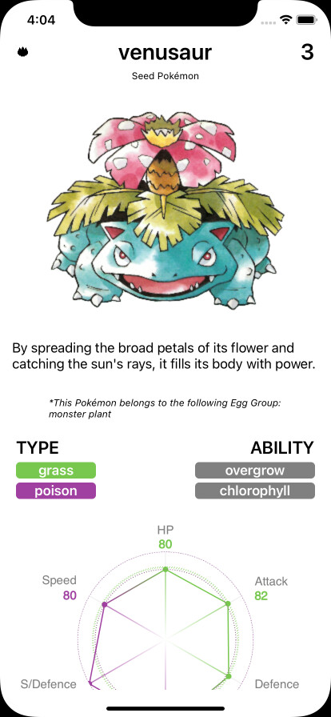| 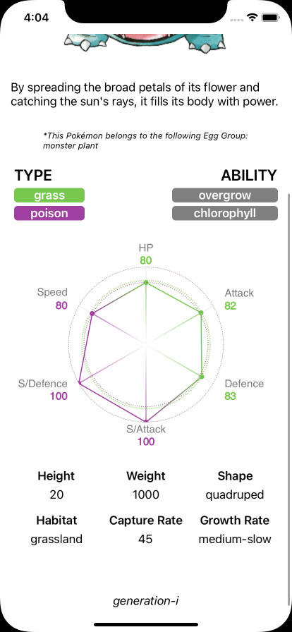| 
|
| 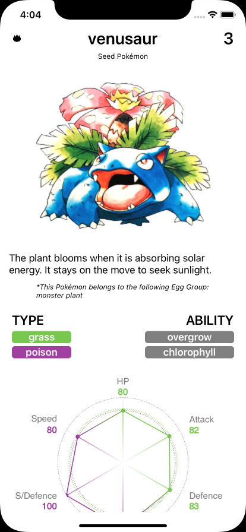| 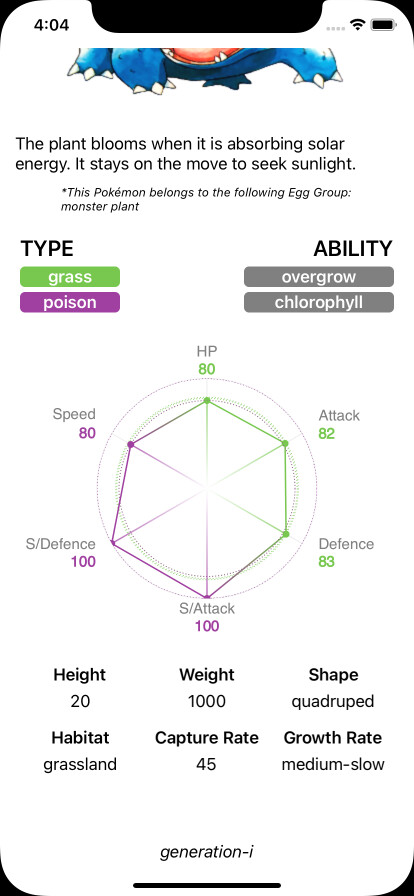| 
